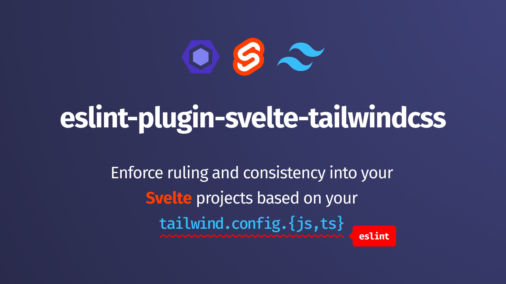

ESLint plugin for enforcing rules anc consistency for TailwindCSS. This project
is a similar to [eslint-plugin-tailwindcss](https://github.com/francoismassart/eslint-plugin-tailwindcss),
but since the plugin does not have direct support for Svelte, this project was
created.

## Attributions

This plugin is heavily inspired by:

- [eslint-plugin-svelte](https://github.com/sveltejs/eslint-plugin-svelte)
- [eslint-plugin-tailwindcss](https://github.com/francoismassart/eslint-plugin-tailwindcss)
- [eslint-plugin-antfu](https://github.com/antfu/eslint-plugin-antfu)

Make sure to check them out if you are looking for more information!
